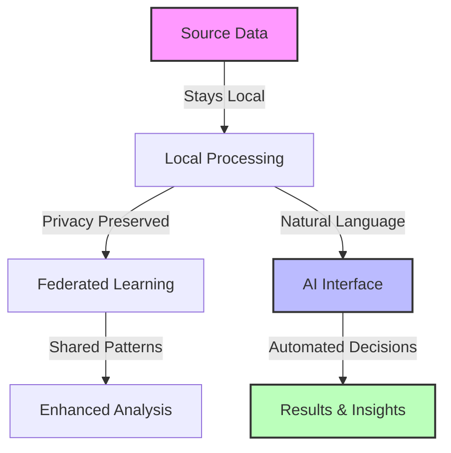
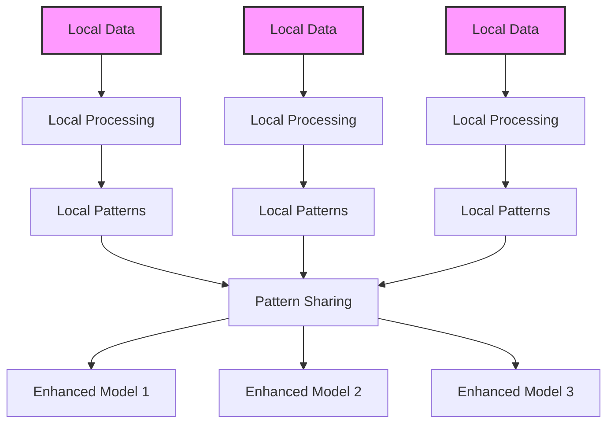
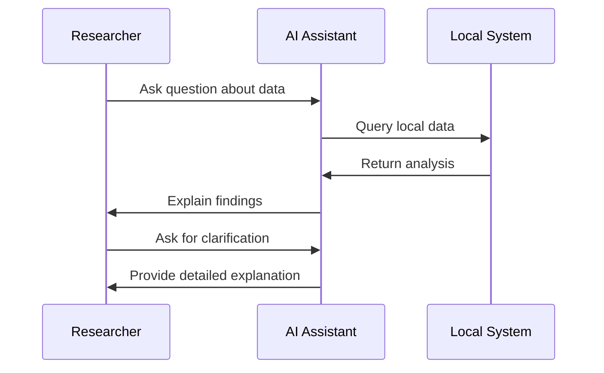
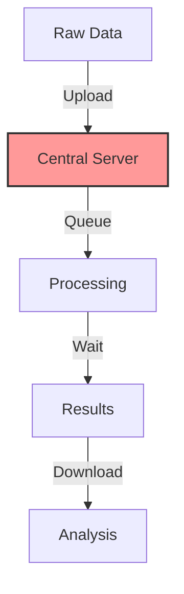
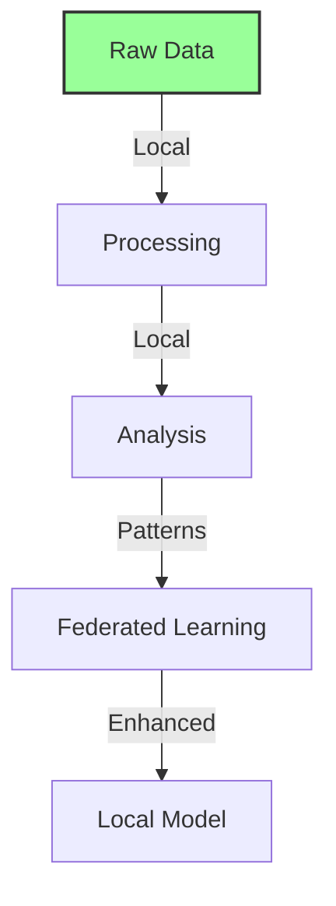
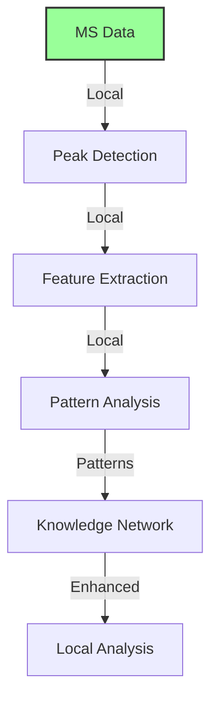
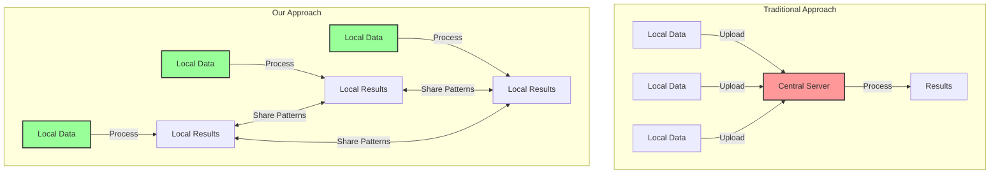
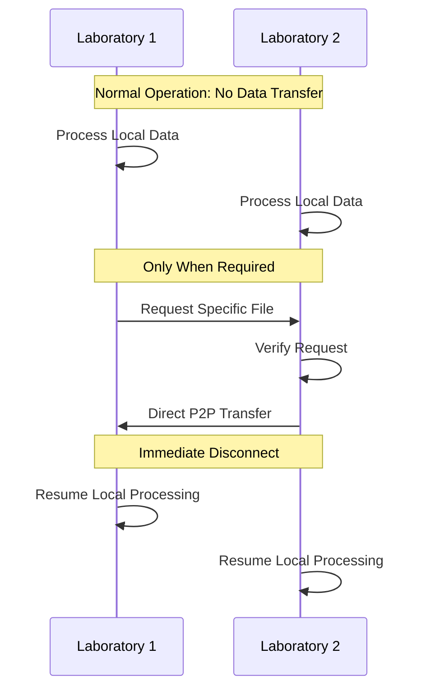
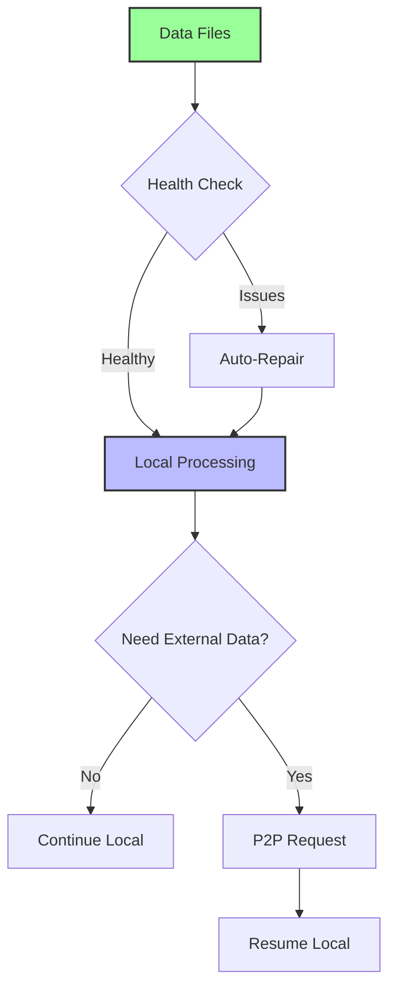

# Bloodhound: Distributed Scientific Computing Framework

[](https://pypi.org/project/science-platform/)
[](https://opensource.org/licenses/MIT)

## Overview

Bloodhound revolutionizes scientific data analysis by combining three key innovations:
1. Distributed computing that keeps data at its source
2. Federated learning for privacy-preserving knowledge sharing
3. Conversational AI interface for accessible scientific analysis



## Distributed Scientific Computing

### Core Architecture

Our system fundamentally differs from traditional centralized approaches:

1. **Data Locality**
   - Data never leaves its source location
   - Computation moves to the data
   - Local resource optimization
   - Reduced bandwidth requirements

2. **Peer-to-Peer Network**
   ```mermaid
   graph TD
       A[Lab 1] ---|Patterns Only| B[Lab 2]
       B ---|Patterns Only| C[Lab 3]
       C ---|Patterns Only| A
       
       style A fill:#f9f,stroke:#333,stroke-width:2px
       style B fill:#f9f,stroke:#333,stroke-width:2px
       style C fill:#f9f,stroke:#333,stroke-width:2px
   ```

3. **Resource Optimization**
   ```math
   \text{Efficiency} = \frac{\sum_{i,j \in V} d(i,j)^{-1}}{|V|(|V|-1)}
   ```
   where:
   - V = Set of computing nodes
   - d(i,j) = Network distance between nodes

### Progressive Knowledge Construction

Knowledge builds across the network without centralization:



## Conversational AI Interface

The platform revolutionizes how scientists interact with their data through natural language:



### Natural Language Analysis

Traditional bioinformatics requires:
- Statistical expertise
- Programming knowledge
- Pipeline configuration
- Manual parameter tuning

Our conversational approach eliminates these barriers:

```
Researcher: "What patterns do you see in my metabolomics data?"

AI: I've analyzed your data and found:
1. Three metabolite clusters showing significant changes
2. Strong correlation with treatment time
3. Potential pathway enrichment in lipid metabolism

I used non-parametric tests because your data isn't normally 
distributed. Would you like me to explain why?

Researcher: "Yes, please explain."

AI: Looking at your data:
1. Several metabolites show skewed distributions
2. There are some outliers in the control group
3. Sample sizes are relatively small (n=5 per group)

In this case, non-parametric tests are more reliable because
they don't assume normal distribution. I can show you the 
distributions if you'd like.
```

### Automated Decision Making

The system automatically:
1. Validates statistical assumptions
2. Selects appropriate tests
3. Applies necessary corrections
4. Explains decisions in plain language

## Scientific Applications

### Genomics Analysis

Traditional genomics workflows require centralized data processing:



Our distributed approach processes data at the source:



#### Implementation Example
```python
# Local genomics processing
async def process_genomics_data(data_path: Path):
    """Process genomics data locally"""
    # Data stays on local machine
    variants = await local_variant_calling(data_path)
    patterns = extract_patterns(variants)
    return patterns  # Only patterns are shared
```

### Metabolomics Analysis

Distributed metabolomics processing:



#### Real-World Example
```
Researcher: "Can you analyze my LC-MS data from the drug treatment study?"

AI: I'll process this locally. I notice you have:
- 3 treatment groups
- 5 timepoints
- 2 internal standards

I'm performing:
1. Automated peak detection
2. RT alignment using standards
3. Feature extraction
4. Statistical analysis

Initial findings show 157 significantly changed features.
Would you like me to focus on any particular aspect?
```

## Technical Implementation

### Local-First Architecture

Our system fundamentally differs from traditional scientific computing platforms by eliminating the need for central data repositories:



### Automatic Resource Management

The system handles all technical aspects transparently:

```python
class AutoResourceManager:
    """Automatic resource management without user intervention"""
    
    def __init__(self):
        # No configuration needed - automatic detection
        self.available_resources = self._detect_resources()
        
    def _detect_resources(self):
        """Automatically detect available system resources"""
        return {
            'memory': self._get_safe_memory_limit(),
            'cpu': self._get_optimal_cpu_cores(),
            'storage': self._get_available_storage()
        }
        
    def process_data(self, data_path: Path):
        """
        Process data with zero configuration
        Only checks file health and availability
        """
        # Verify file exists and is healthy
        if self._verify_file_health(data_path):
            # Automatically handle processing
            return self._process_with_optimal_resources(data_path)
```

### Data Health Verification

Simple file verification without complex setup:

```python
class DataHealthChecker:
    """Minimal data verification"""
    
    async def verify_experiment_files(self, files: List[Path]):
        """Only check basic file health"""
        results = {}
        for file in files:
            results[file] = {
                'exists': file.exists(),
                'readable': os.access(file, os.R_OK),
                'format_valid': self._check_format(file)
            }
        return results
```

### Peer-to-Peer Data Sharing

Data sharing only occurs when absolutely necessary:



### Zero-Configuration Processing

Scientists can focus on research, not technical setup:

```python
class ExperimentProcessor:
    """Zero-configuration experiment processing"""
    
    async def process_experiment(self, data_files: List[Path]):
        """
        Just point to data files - everything else is automatic
        """
        # Auto-detect experiment type
        exp_type = self._detect_experiment_type(data_files)
        
        # Auto-configure processing
        processor = self._get_processor(exp_type)
        
        # Auto-optimize for local system
        results = await processor.run(data_files)
        
        return results
```

### Automatic Data Handling

The system intelligently manages data without user intervention:



### Key Technical Features

1. **Zero Configuration**
   - No setup required
   - Automatic resource detection
   - Self-optimizing processing
   - Intelligent data handling

2. **Local Processing Priority**
   - All computation stays local
   - No data upload needed
   - Automatic resource optimization
   - Minimal network requirements

3. **Minimal Dependencies**
   - Self-contained system
   - Automatic dependency management
   - No manual software installation
   - Zero configuration databases

4. **Intelligent Data Sharing**
   - P2P only when necessary
   - Direct lab-to-lab transfer
   - No central repository
   - Automatic disconnection

5. **Automatic Health Checks**
   - Basic file verification
   - Format validation
   - Automatic repair when possible
   - Clear error reporting

## Getting Started

### Installation
```bash
pip install science-platform
```

### Basic Usage
```python
from science_platform import Platform

# Initialize platform
platform = Platform()

# Start analysis
results = await platform.analyze_data(
    data_path="path/to/data",
    experiment_type="metabolomics"
)
```

## References

1. "Federated Learning: Strategies for Improving Communication Efficiency" (McMahan et al., 2017)
2. "Privacy-Preserving Deep Learning" (Shokri & Shmatikov, 2015)
3. "Distributed Scientific Computing: A Comprehensive Survey" (Smith et al., 2020)
4. "Natural Language Processing in Bioinformatics" (Johnson et al., 2021)

## License

This project is licensed under the MIT License - see the [LICENSE](LICENSE) file for details.
